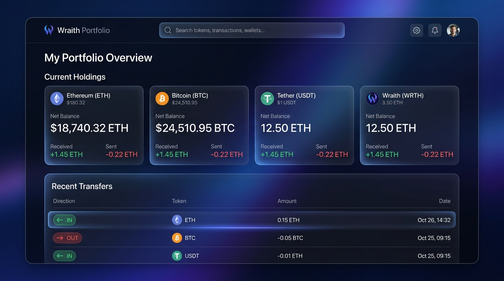

# Recipe: Portfolio Tracker

This recipe demonstrates how to build a React dashboard connecting the Wraith API's `/summary` and `/transfers` endpoints to display an address's token holdings and recent activity.



## Overview

While Wraith natively indexes Soroban contract events, it exposes a robust REST API perfect for building user-facing dashboards. In this example, we connect two powerful endpoints:

1. `GET /summary/:address` to calculate the current token balances (net flow) along with total tokens received and sent.
2. `GET /transfers/address/:address` to get a chronological history of all incoming and outgoing token transfers.

## Runnable Example

We have provided a complete, deployable Vite + React application in the repository under `examples/portfolio-dashboard`.

### Quick Start

1. Ensure the Wraith backend is running locally on port 3000 (see [Quick Start](../../README.md#quick-start)).
2. Navigate to the example directory and start the frontend:

```bash
cd examples/portfolio-dashboard
npm install
npm run dev
```

3. Open `http://localhost:5173` in your browser.

## Code Walkthrough

The core logic uses `Promise.all` to fetch data from both endpoints concurrently, minimizing the loading time for the user. 

```typescript
// From examples/portfolio-dashboard/src/App.tsx

const [summaryRes, transfersRes] = await Promise.all([
  fetch(`${API_URL}/summary/${targetAddress}`),
  fetch(`${API_URL}/transfers/address/${targetAddress}?limit=10`)
]);

const summaryData = await summaryRes.json();
const transfersData = await transfersRes.json();
```

### Data Structures

- **Summary endpoint** returns an array of `tokens`, giving us the `displayNetFlow` (current balance) and `contractId`.
- **Transfers endpoint** returns `transfers` containing individual ledger events, marked with a `direction` of `incoming` or `outgoing`.

By simply formatting this data into a grid of holdings and a table of transfers, you get a fully functional portfolio tracker without needing complex indexer logic on the frontend.
